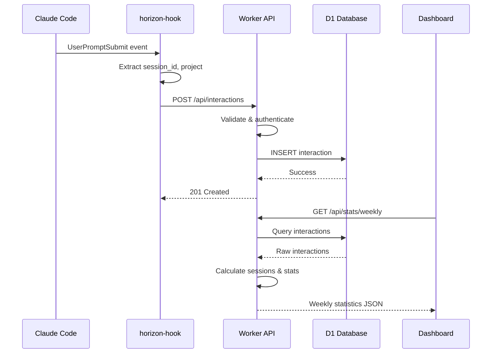

# Horizon v1 - Design Document

## Overview

Horizon is a personal time tracking system for AI coding sessions. This document describes the technical design for deploying Horizon on Cloudflare Workers with D1 database.

### System Context

```
┌─────────────────┐     ┌──────────────────────────────────────┐
│  Claude Code    │     │           Cloudflare                 │
│  (hooks)        │────▶│  ┌─────────────┐   ┌─────────────┐  │
└─────────────────┘     │  │   Worker    │──▶│     D1      │  │
                        │  │  (Hono API) │   │  (SQLite)   │  │
┌─────────────────┐     │  └─────────────┘   └─────────────┘  │
│   Dashboard     │────▶│                                      │
│   (browser)     │     │  ┌─────────────┐                    │
└─────────────────┘     │  │   Pages     │                    │
                        │  │  (static)   │                    │
                        │  └─────────────┘                    │
                        └──────────────────────────────────────┘

┌─────────────────┐
│  ~/.local/bin/  │
│  horizon-hook   │  (bash script, runs locally)
└─────────────────┘
```

### Technology Stack

| Component | Technology | Purpose |
|-----------|------------|---------|
| API Framework | Hono | Lightweight, runs on Workers, TypeScript |
| Database | Cloudflare D1 | SQLite at edge, serverless |
| Dashboard | Static HTML/CSS/JS | No build step, vanilla JS |
| Hook | Bash script | Integrates with Claude Code |
| Deployment | Wrangler | CLI for Workers/D1/Pages |

---

## Architecture

### Project Structure

```
horizon/
├── src/
│   ├── index.ts              # Worker entry point
│   ├── routes/
│   │   ├── interactions.ts   # POST /api/interactions
│   │   └── stats.ts          # GET /api/stats/*, /api/projects/*
│   ├── services/
│   │   ├── sessions.ts       # Session derivation logic
│   │   └── statistics.ts     # Statistics calculation
│   ├── middleware/
│   │   └── auth.ts           # API key authentication
│   ├── db/
│   │   └── queries.ts        # D1 query helpers
│   └── types.ts              # TypeScript interfaces
├── dashboard/
│   ├── index.html            # Main dashboard page
│   ├── styles.css            # Ground Control theme
│   ├── app.js                # Dashboard logic
│   └── config.js             # API URL configuration
├── hooks/
│   ├── horizon-hook          # Bash hook script
│   └── config.example.json   # Example configuration
├── schema.sql                # D1 database schema
├── wrangler.toml             # Cloudflare configuration
├── package.json
└── tsconfig.json
```

### Request Flow



---

## Components and Interfaces

### 1. Worker Entry Point (`src/index.ts`)

Initializes the Hono app with middleware and routes.

```typescript
import { Hono } from 'hono';
import { cors } from 'hono/cors';
import { apiKeyAuth } from './middleware/auth';
import interactionsRoutes from './routes/interactions';
import statsRoutes from './routes/stats';

type Bindings = {
  DB: D1Database;
  API_KEY: string;
  CORS_ORIGIN: string;
};

const app = new Hono<{ Bindings: Bindings }>();

// CORS middleware (configurable origin)
app.use('/api/*', async (c, next) => {
  const corsMiddleware = cors({
    origin: c.env.CORS_ORIGIN || '*',
    allowHeaders: ['Content-Type', 'x-api-key'],
    allowMethods: ['GET', 'POST', 'OPTIONS'],
  });
  return corsMiddleware(c, next);
});

// API key authentication
app.use('/api/*', apiKeyAuth());

// Mount routes
app.route('/api', interactionsRoutes);
app.route('/api', statsRoutes);

export default app;
```

**Requirement Coverage:** [6.1], [6.5], [17.1], [17.2], [17.3]

---

### 2. Authentication Middleware (`src/middleware/auth.ts`)

Validates API key from header against environment secret.

```typescript
import { Context, Next } from 'hono';
import { HTTPException } from 'hono/http-exception';

export function apiKeyAuth() {
  return async (c: Context, next: Next) => {
    const apiKey = c.req.header('x-api-key');

    if (!apiKey) {
      return c.json({ error: 'Unauthorized' }, 401);
    }

    if (apiKey !== c.env.API_KEY) {
      return c.json({ error: 'Forbidden' }, 403);
    }

    await next();
  };
}
```

**Requirement Coverage:** [6.1], [6.2], [6.3], [6.4]

---

### 3. Interactions Route (`src/routes/interactions.ts`)

Handles recording new interactions with validation and idempotency.

```typescript
import { Hono } from 'hono';
import { Interaction, EventType } from '../types';

const VALID_EVENT_TYPES: EventType[] = ['prompt-start', 'response-end', 'session-end'];

const app = new Hono();

app.post('/interactions', async (c) => {
  const body = await c.req.json<Partial<Interaction>>();

  // Validate required fields
  const required = ['project', 'timestamp', 'machine', 'agent', 'session_id', 'event_type'];
  for (const field of required) {
    if (!body[field as keyof Interaction]) {
      return c.json({ error: `Missing required field: ${field}` }, 400);
    }
  }

  // Validate event_type
  if (!VALID_EVENT_TYPES.includes(body.event_type as EventType)) {
    return c.json({ error: `Invalid event_type. Must be one of: ${VALID_EVENT_TYPES.join(', ')}` }, 400);
  }

  // Validate timestamp format (ISO 8601)
  if (isNaN(Date.parse(body.timestamp!))) {
    return c.json({ error: 'Invalid timestamp format. Use ISO 8601.' }, 400);
  }

  // Insert with idempotency (unique constraint handles duplicates)
  try {
    await c.env.DB.prepare(`
      INSERT INTO interactions (project, timestamp, machine, agent, session_id, event_type)
      VALUES (?, ?, ?, ?, ?, ?)
      ON CONFLICT (session_id, timestamp, event_type) DO NOTHING
    `).bind(
      body.project,
      body.timestamp,
      body.machine,
      body.agent,
      body.session_id,
      body.event_type
    ).run();

    return c.json({ status: 'recorded' }, 201);
  } catch (error) {
    console.error('Failed to record interaction:', error);
    return c.json({ error: 'Internal server error' }, 500);
  }
});

export default app;
```

**Requirement Coverage:** [1.1], [1.2], [1.3], [1.4], [1.5], [1.6], [1.7], [18.1], [18.2], [18.3]

---

### 4. Statistics Routes (`src/routes/stats.ts`)

Handles all statistics and session endpoints.

```typescript
import { Hono } from 'hono';
import { calculateSessions, Session } from '../services/sessions';
import { calculateWeeklyStats, calculateProjectStats } from '../services/statistics';

const app = new Hono();

// GET /api/stats/weekly
app.get('/stats/weekly', async (c) => {
  const weekStartParam = c.req.query('week_start');
  const weekStart = weekStartParam
    ? new Date(weekStartParam + 'T00:00:00Z')
    : getMonday(new Date());

  const weekEnd = new Date(weekStart);
  weekEnd.setDate(weekEnd.getDate() + 7);

  const { results: interactions } = await c.env.DB.prepare(`
    SELECT * FROM interactions
    WHERE timestamp >= ? AND timestamp < ?
    ORDER BY timestamp ASC
  `).bind(weekStart.toISOString(), weekEnd.toISOString()).all();

  const stats = calculateWeeklyStats(interactions, weekStart);
  return c.json(stats);
});

// GET /api/stats/projects
app.get('/stats/projects', async (c) => {
  const days = parseInt(c.req.query('days') || '30');
  const startDate = new Date();
  startDate.setDate(startDate.getDate() - days);

  const { results: interactions } = await c.env.DB.prepare(`
    SELECT * FROM interactions
    WHERE timestamp >= ?
    ORDER BY timestamp ASC
  `).bind(startDate.toISOString()).all();

  const stats = calculateProjectStats(interactions);
  return c.json({ projects: stats });
});

// GET /api/projects/:name/sessions
app.get('/projects/:name/sessions', async (c) => {
  const projectName = c.req.param('name');
  const days = parseInt(c.req.query('days') || '7');
  const startDate = new Date();
  startDate.setDate(startDate.getDate() - days);

  const { results: interactions } = await c.env.DB.prepare(`
    SELECT * FROM interactions
    WHERE project = ? AND timestamp >= ?
    ORDER BY timestamp ASC
  `).bind(projectName, startDate.toISOString()).all();

  if (interactions.length === 0) {
    // Check if project exists at all
    const { results: exists } = await c.env.DB.prepare(`
      SELECT 1 FROM interactions WHERE project = ? LIMIT 1
    `).bind(projectName).all();

    if (exists.length === 0) {
      return c.json({ error: 'Project not found' }, 404);
    }
  }

  const sessions = calculateSessions(interactions);
  return c.json({ project: projectName, sessions });
});

function getMonday(date: Date): Date {
  const d = new Date(date);
  const day = d.getUTCDay();
  const diff = d.getUTCDate() - day + (day === 0 ? -6 : 1);
  d.setUTCDate(diff);
  d.setUTCHours(0, 0, 0, 0);
  return d;
}

export default app;
```

**Requirement Coverage:** [3.1]-[3.10], [4.1]-[4.5], [5.1]-[5.7]

---

### 5. Session Derivation Service (`src/services/sessions.ts`)

Core algorithm for deriving sessions from paired events.

```typescript
import { Interaction, Session, EventType } from '../types';

const DEFAULT_DURATION_MINUTES = 5;

export function calculateSessions(interactions: Interaction[]): Session[] {
  // Group by session_id
  const grouped = new Map<string, Interaction[]>();
  for (const interaction of interactions) {
    const existing = grouped.get(interaction.session_id) || [];
    existing.push(interaction);
    grouped.set(interaction.session_id, existing);
  }

  const sessions: Session[] = [];

  for (const [sessionId, events] of grouped) {
    // Sort by timestamp (requirement 2.7)
    events.sort((a, b) =>
      new Date(a.timestamp).getTime() - new Date(b.timestamp).getTime()
    );

    const session = deriveSession(sessionId, events);
    sessions.push(session);
  }

  // Sort sessions by start time descending (requirement 5.5)
  sessions.sort((a, b) =>
    new Date(b.start).getTime() - new Date(a.start).getTime()
  );

  return sessions;
}

function deriveSession(sessionId: string, events: Interaction[]): Session {
  if (events.length === 0) {
    throw new Error('Cannot derive session from empty events');
  }

  const firstEvent = events[0];
  const lastEvent = events[events.length - 1];

  // Determine if session is explicitly ended or active
  const hasSessionEnd = events.some(e => e.event_type === 'session-end');
  const lastPromptStart = [...events]
    .reverse()
    .find(e => e.event_type === 'prompt-start');
  const hasMatchingResponseEnd = lastPromptStart
    ? events.some(e =>
        e.event_type === 'response-end' &&
        new Date(e.timestamp) > new Date(lastPromptStart.timestamp)
      )
    : true;

  // Active session: has prompt-start without response-end/session-end (requirement 5.7)
  const isActive = !hasSessionEnd && !hasMatchingResponseEnd;

  // Calculate active time from paired events
  const activeMinutes = calculateActiveTime(events);

  // Session span
  const startTime = new Date(firstEvent.timestamp);
  const endTime = isActive ? null : new Date(lastEvent.timestamp);
  const spanMinutes = endTime
    ? Math.round((endTime.getTime() - startTime.getTime()) / 60000)
    : Math.round((Date.now() - startTime.getTime()) / 60000);

  // Count interactions (prompt-start events)
  const interactionCount = events.filter(e => e.event_type === 'prompt-start').length;

  return {
    session_id: sessionId,
    project: firstEvent.project,
    start: firstEvent.timestamp,
    end: endTime?.toISOString() ?? null,
    span_minutes: spanMinutes,
    active_minutes: activeMinutes,
    machine: firstEvent.machine,
    agent: firstEvent.agent,
    interaction_count: interactionCount,
    explicit_end: hasSessionEnd,
  };
}

function calculateActiveTime(events: Interaction[]): number {
  let totalMinutes = 0;
  const promptStarts: Interaction[] = [];

  for (const event of events) {
    if (event.event_type === 'prompt-start') {
      promptStarts.push(event);
    } else if (event.event_type === 'response-end') {
      // Pair with earliest unpaired prompt-start (requirement 2.7)
      const promptStart = promptStarts.shift();
      if (promptStart) {
        const start = new Date(promptStart.timestamp).getTime();
        const end = new Date(event.timestamp).getTime();
        // Clamp to zero to handle potential clock skew
        totalMinutes += Math.max(0, (end - start) / 60000);
      }
      // Orphaned response-end is ignored (requirement 2.8)
    }
    // session-end doesn't affect active time calculation
  }

  // Unpaired prompt-starts get default duration (requirement 2.4)
  totalMinutes += promptStarts.length * DEFAULT_DURATION_MINUTES;

  return Math.round(totalMinutes * 10) / 10; // Round to 1 decimal
}
```

**Requirement Coverage:** [2.1]-[2.8]

---

### 6. Statistics Service (`src/services/statistics.ts`)

Calculates weekly and project statistics.

```typescript
import { Interaction, WeeklyStats, ProjectStats } from '../types';
import { calculateSessions } from './sessions';

export function calculateWeeklyStats(
  interactions: Interaction[],
  weekStart: Date
): WeeklyStats {
  const sessions = calculateSessions(interactions);

  // Total hours (active time)
  const totalHours = sessions.reduce((sum, s) => sum + s.active_minutes, 0) / 60;

  // Daily breakdown
  const dailyBreakdown = calculateDailyBreakdown(sessions, weekStart);

  // Project breakdown
  const projects = calculateProjectBreakdown(sessions);

  // Agent breakdown
  const agents = calculateAgentBreakdown(sessions, totalHours);

  // Streak calculation (consecutive days with at least one session)
  const streakDays = calculateStreak(interactions);

  return {
    total_hours: Math.round(totalHours * 10) / 10,
    total_sessions: sessions.length,
    streak_days: streakDays,
    daily_breakdown: dailyBreakdown,
    projects,
    agents,
    comparison: {
      vs_last_week: 0, // Calculated separately if previous week data available
    },
  };
}

function calculateDailyBreakdown(sessions: Session[], weekStart: Date) {
  const days: { date: string; hours: number; sessions: number }[] = [];

  for (let i = 0; i < 7; i++) {
    const date = new Date(weekStart);
    date.setDate(date.getDate() + i);
    const dateStr = date.toISOString().split('T')[0];

    const daySessions = sessions.filter(s => s.start.startsWith(dateStr));
    const hours = daySessions.reduce((sum, s) => sum + s.active_minutes, 0) / 60;

    days.push({
      date: dateStr,
      hours: Math.round(hours * 10) / 10,
      sessions: daySessions.length,
    });
  }

  return days;
}

function calculateProjectBreakdown(sessions: Session[]) {
  const projectMap = new Map<string, { hours: number; sessions: number }>();

  for (const session of sessions) {
    const existing = projectMap.get(session.project) || { hours: 0, sessions: 0 };
    existing.hours += session.active_minutes / 60;
    existing.sessions += 1;
    projectMap.set(session.project, existing);
  }

  return Array.from(projectMap.entries())
    .map(([name, data]) => ({
      name,
      hours: Math.round(data.hours * 10) / 10,
      sessions: data.sessions,
    }))
    .sort((a, b) => b.hours - a.hours);
}

function calculateAgentBreakdown(sessions: Session[], totalHours: number) {
  const agentMap = new Map<string, number>();

  for (const session of sessions) {
    const existing = agentMap.get(session.agent) || 0;
    agentMap.set(session.agent, existing + session.active_minutes / 60);
  }

  return Array.from(agentMap.entries())
    .map(([name, hours]) => ({
      name,
      hours: Math.round(hours * 10) / 10,
      percentage: totalHours > 0 ? Math.round((hours / totalHours) * 100) : 0,
    }))
    .sort((a, b) => b.hours - a.hours);
}

function calculateStreak(interactions: Interaction[]): number {
  // Get unique dates with sessions (UTC)
  const datesWithSessions = new Set<string>();
  for (const interaction of interactions) {
    datesWithSessions.add(interaction.timestamp.split('T')[0]);
  }

  // Count consecutive days going backwards from today
  let streak = 0;
  const today = new Date();
  today.setUTCHours(0, 0, 0, 0);

  for (let i = 0; i < 365; i++) {
    const checkDate = new Date(today);
    checkDate.setDate(checkDate.getDate() - i);
    const dateStr = checkDate.toISOString().split('T')[0];

    if (datesWithSessions.has(dateStr)) {
      streak++;
    } else if (i > 0) {
      // Allow today to be missing (not yet coded today)
      break;
    }
  }

  return streak;
}
```

**Requirement Coverage:** [3.3]-[3.9]

---

### 7. TypeScript Types (`src/types.ts`)

```typescript
export type EventType = 'prompt-start' | 'response-end' | 'session-end';

export interface Interaction {
  id?: number;
  project: string;
  timestamp: string;
  machine: string;
  agent: string;
  session_id: string;
  event_type: EventType;
  created_at?: string;
}

export interface Session {
  session_id: string;
  project: string;
  start: string;
  end: string | null;
  span_minutes: number;
  active_minutes: number;
  machine: string;
  agent: string;
  interaction_count: number;
  explicit_end: boolean;
}

export interface WeeklyStats {
  total_hours: number;
  total_sessions: number;
  streak_days: number;
  daily_breakdown: DailyBreakdown[];
  projects: ProjectSummary[];
  agents: AgentSummary[];
  comparison: {
    vs_last_week: number;
  };
}

export interface DailyBreakdown {
  date: string;
  hours: number;
  sessions: number;
}

export interface ProjectSummary {
  name: string;
  hours: number;
  sessions: number;
}

export interface AgentSummary {
  name: string;
  hours: number;
  percentage: number;
}

export interface ProjectStats {
  name: string;
  total_hours: number;
  total_sessions: number;
  agents: Record<string, number>;
}
```

---

## Data Models

### Database Schema (`schema.sql`)

```sql
-- Interactions table
CREATE TABLE IF NOT EXISTS interactions (
    id INTEGER PRIMARY KEY AUTOINCREMENT,
    project TEXT NOT NULL,
    timestamp TEXT NOT NULL,
    machine TEXT NOT NULL,
    agent TEXT NOT NULL,
    session_id TEXT NOT NULL,
    event_type TEXT NOT NULL CHECK (event_type IN ('prompt-start', 'response-end', 'session-end')),
    created_at TEXT DEFAULT (datetime('now'))
);

-- Unique constraint for idempotency (requirement 7.6)
CREATE UNIQUE INDEX IF NOT EXISTS idx_interactions_unique
ON interactions(session_id, timestamp, event_type);

-- Index for project + time range queries (requirement 7.2)
CREATE INDEX IF NOT EXISTS idx_interactions_project_timestamp
ON interactions(project, timestamp DESC);

-- Index for date-based queries (requirement 7.3)
CREATE INDEX IF NOT EXISTS idx_interactions_date
ON interactions(date(timestamp), timestamp DESC);

-- Index for session grouping (requirement 7.4)
CREATE INDEX IF NOT EXISTS idx_interactions_session
ON interactions(session_id, timestamp ASC);

-- Index for agent statistics (requirement 7.5)
CREATE INDEX IF NOT EXISTS idx_interactions_agent
ON interactions(agent, timestamp DESC);
```

**Requirement Coverage:** [7.1]-[7.6]

---

## Dashboard Design

### Component Structure

```
dashboard/
├── index.html          # Single-page app shell
├── styles.css          # Ground Control theme (from mockup)
├── config.js           # API configuration
└── app.js              # Application logic
```

### State Management

The dashboard uses a simple state object pattern:

```javascript
// app.js
const state = {
  weeklyStats: null,
  selectedProject: null,
  projectSessions: [],
  lastSync: null,
  isOffline: false,
  apiKey: localStorage.getItem('horizon_api_key'),
};

async function init() {
  if (!state.apiKey) {
    showApiKeySetup();
    return;
  }

  await loadWeeklyStats();
  render();

  // Auto-refresh every 5 minutes
  setInterval(loadWeeklyStats, 5 * 60 * 1000);
}

async function loadWeeklyStats() {
  try {
    const response = await fetch(`${CONFIG.API_URL}/api/stats/weekly`, {
      headers: { 'x-api-key': state.apiKey },
    });

    if (!response.ok) throw new Error('API error');

    state.weeklyStats = await response.json();
    state.lastSync = new Date();
    state.isOffline = false;

    // Cache in localStorage
    localStorage.setItem('horizon_cache', JSON.stringify({
      weeklyStats: state.weeklyStats,
      cachedAt: state.lastSync.toISOString(),
    }));

    render();
  } catch (error) {
    // Fall back to cached data
    const cached = JSON.parse(localStorage.getItem('horizon_cache') || '{}');
    if (cached.weeklyStats) {
      state.weeklyStats = cached.weeklyStats;
      state.isOffline = true;
    }
    render();
  }
}

function render() {
  renderHeader();
  renderStatsCards();
  renderWeeklyActivity();
  renderProjectsList();
  renderSessionDetail();
  renderAgentsPanels();
}
```

**Requirement Coverage:** [8.1]-[8.5], [9.1]-[9.6], [10.1]-[10.5], [11.1]-[11.5], [12.1]-[12.4], [13.1]-[13.5]

### Configuration (`config.js`)

```javascript
// config.js - Edit API_URL before deployment
const CONFIG = {
  API_URL: 'https://horizon-api.your-subdomain.workers.dev',
};
```

**Requirement Coverage:** [13.5]

---

## Hook Script Design

### Script Location and Configuration

```bash
# ~/.local/bin/horizon-hook
#!/bin/bash
# Note: We intentionally use basic error handling rather than set -euo pipefail
# to ensure the script always exits 0 per requirement [14.8]

CONFIG_FILE="$HOME/.config/horizon/config.json"
LOG_FILE="$HOME/.config/horizon/error.log"
EVENT_TYPE="${1:-prompt-start}"

# Ensure config directory exists
mkdir -p "$(dirname "$LOG_FILE")"

log_error() {
    echo "$(date -u +%Y-%m-%dT%H:%M:%SZ) - $1" >> "$LOG_FILE"
}

# Read hook input from stdin
HOOK_INPUT=$(cat)

# Extract session_id from hook input
SESSION_ID=$(echo "$HOOK_INPUT" | jq -r '.session_id // empty')
if [[ -z "$SESSION_ID" ]]; then
    SESSION_ID="generated-$(date +%s)-$$"
fi

# Read config
if [[ ! -f "$CONFIG_FILE" ]]; then
    log_error "Config file not found: $CONFIG_FILE"
    exit 0
fi

API_URL=$(jq -r '.api_url // empty' "$CONFIG_FILE")
API_KEY=$(jq -r '.api_key // empty' "$CONFIG_FILE")

if [[ -z "$API_URL" || -z "$API_KEY" ]]; then
    log_error "Missing api_url or api_key in config"
    exit 0
fi

# Determine project name from git remote, fallback to directory name
PROJECT=""
if git rev-parse --git-dir > /dev/null 2>&1; then
    REMOTE_URL=$(git remote get-url origin 2>/dev/null || true)
    if [[ -n "$REMOTE_URL" ]]; then
        PROJECT=$(echo "$REMOTE_URL" | sed -E 's/.*[\/:}([^\/]+)(\.git)?$/\1/' | sed 's/\.git$//')
    fi
fi

if [[ -z "$PROJECT" ]]; then
    PROJECT=$(basename "$(pwd)")
fi

# Normalize project name: lowercase, hyphens for special chars
PROJECT=$(echo "$PROJECT" | tr '[:upper:]' '[:lower:]' | sed 's/[^a-z0-9-]/-/g' | sed 's/--*/-/g')

# Build payload
TIMESTAMP=$(date -u +%Y-%m-%dT%H:%M:%SZ)
MACHINE=$(hostname -s)
AGENT="claude-code"

PAYLOAD=$(jq -n \
    --arg project "$PROJECT" \
    --arg timestamp "$TIMESTAMP" \
    --arg machine "$MACHINE" \
    --arg agent "$AGENT" \
    --arg session_id "$SESSION_ID" \
    --arg event_type "$EVENT_TYPE" \
    '{project: $project, timestamp: $timestamp, machine: $machine, agent: $agent, session_id: $session_id, event_type: $event_type}')

# Send to API (5-second timeout, silent failure)
HTTP_CODE=$(curl -s -o /dev/null -w "%{http_code}" \
    -X POST "$API_URL/api/interactions" \
    -H "x-api-key: $API_KEY" \
    -H "Content-Type: application/json" \
    -d "$PAYLOAD" \
    --max-time 5 \
    2>/dev/null) || HTTP_CODE="000"

if [[ "$HTTP_CODE" != "201" && "$HTTP_CODE" != "200" ]]; then
    log_error "API request failed with HTTP $HTTP_CODE for project=$PROJECT session=$SESSION_ID event=$EVENT_TYPE"
fi

exit 0
```

**Requirement Coverage:** [14.1]-[14.10]

### Claude Code Settings Template

```json
{
  "hooks": {
    "UserPromptSubmit": [
      {
        "command": "~/.local/bin/horizon-hook prompt-start",
        "timeout": 5000
      }
    ],
    "Stop": [
      {
        "command": "~/.local/bin/horizon-hook response-end",
        "timeout": 5000
      }
    ],
    "SessionEnd": [
      {
        "command": "~/.local/bin/horizon-hook session-end",
        "timeout": 5000
      }
    ]
  }
}
```

**Requirement Coverage:** [15.1]-[15.3]

---

## Deployment Configuration

### Wrangler Configuration (`wrangler.toml`)

```toml
name = "horizon-api"
main = "src/index.ts"
compatibility_date = "2024-01-01"

[[d1_databases]]
binding = "DB"
database_name = "horizon"
database_id = "<your-database-id>"  # Set after running: wrangler d1 create horizon

[vars]
CORS_ORIGIN = "*"  # Change to dashboard URL in production

# API_KEY should be set as a secret:
# wrangler secret put API_KEY
```

**Requirement Coverage:** [16.1]-[16.5]

### API Key Setup

Generate a secure API key and configure it in all locations:

```bash
# Generate a random API key
API_KEY=$(openssl rand -hex 32)
echo "Your API key: $API_KEY"

# Set as Cloudflare secret
wrangler secret put API_KEY
# (paste the generated key when prompted)

# Configure hook
mkdir -p ~/.config/horizon
cat > ~/.config/horizon/config.json << EOF
{
  "api_url": "https://horizon-api.your-subdomain.workers.dev",
  "api_key": "$API_KEY"
}
EOF
chmod 600 ~/.config/horizon/config.json

# Dashboard: Enter the API key in the browser when first loading
# It will be stored in localStorage
```

### Deployment Commands

```bash
# Initial setup
wrangler d1 create horizon
# Copy database_id to wrangler.toml

# Initialize schema
wrangler d1 execute horizon --file=schema.sql

# Set API key secret
wrangler secret put API_KEY

# Deploy worker
wrangler deploy

# Deploy dashboard to Pages
cd dashboard
wrangler pages deploy . --project-name=horizon-dashboard
```

**Requirement Coverage:** [16.5], [16.6]

---

## Error Handling

### API Error Responses

| Scenario | HTTP Status | Response Body |
|----------|-------------|---------------|
| Missing API key | 401 | `{"error": "Unauthorized"}` |
| Invalid API key | 403 | `{"error": "Forbidden"}` |
| Missing required field | 400 | `{"error": "Missing required field: {field}"}` |
| Invalid event_type | 400 | `{"error": "Invalid event_type. Must be one of: ..."}` |
| Invalid timestamp | 400 | `{"error": "Invalid timestamp format. Use ISO 8601."}` |
| Project not found | 404 | `{"error": "Project not found"}` |
| Internal error | 500 | `{"error": "Internal server error"}` |

**Requirement Coverage:** [6.3], [6.4], [18.1]-[18.3]

### Logging

Errors are logged to the Cloudflare Workers console with:
- Timestamp
- Endpoint
- Error type
- Error message (sanitized)

```typescript
console.error(JSON.stringify({
  timestamp: new Date().toISOString(),
  endpoint: c.req.path,
  error_type: error.name,
  message: error.message,
}));
```

**Requirement Coverage:** [18.4]

---

## Testing Strategy

### Unit Tests

Tests are written using Vitest (Cloudflare Workers compatible).

#### Session Derivation Tests (`src/services/sessions.test.ts`)

```typescript
import { describe, it, expect } from 'vitest';
import { calculateSessions } from './sessions';

describe('calculateSessions', () => {
  it('calculates active time from paired prompt-response events', () => {
    const interactions = [
      { session_id: 's1', timestamp: '2026-01-19T10:00:00Z', event_type: 'prompt-start', ... },
      { session_id: 's1', timestamp: '2026-01-19T10:20:00Z', event_type: 'response-end', ... },
    ];
    const sessions = calculateSessions(interactions);
    expect(sessions[0].active_minutes).toBe(20);
  });

  it('uses 5-minute default for unpaired prompt-start', () => {
    const interactions = [
      { session_id: 's1', timestamp: '2026-01-19T10:00:00Z', event_type: 'prompt-start', ... },
    ];
    const sessions = calculateSessions(interactions);
    expect(sessions[0].active_minutes).toBe(5);
  });

  it('handles explicit session-end', () => {
    const interactions = [
      { session_id: 's1', timestamp: '2026-01-19T10:00:00Z', event_type: 'prompt-start', ... },
      { session_id: 's1', timestamp: '2026-01-19T10:20:00Z', event_type: 'response-end', ... },
      { session_id: 's1', timestamp: '2026-01-19T10:30:00Z', event_type: 'session-end', ... },
    ];
    const sessions = calculateSessions(interactions);
    expect(sessions[0].explicit_end).toBe(true);
  });

  it('processes events in timestamp order regardless of arrival order', () => {
    const interactions = [
      { session_id: 's1', timestamp: '2026-01-19T10:20:00Z', event_type: 'response-end', ... },
      { session_id: 's1', timestamp: '2026-01-19T10:00:00Z', event_type: 'prompt-start', ... },
    ];
    const sessions = calculateSessions(interactions);
    expect(sessions[0].active_minutes).toBe(20);
  });

  it('pairs consecutive prompt-starts with next available response-ends', () => {
    const interactions = [
      { session_id: 's1', timestamp: '2026-01-19T10:00:00Z', event_type: 'prompt-start', ... },
      { session_id: 's1', timestamp: '2026-01-19T10:05:00Z', event_type: 'prompt-start', ... },
      { session_id: 's1', timestamp: '2026-01-19T10:10:00Z', event_type: 'response-end', ... },
      { session_id: 's1', timestamp: '2026-01-19T10:20:00Z', event_type: 'response-end', ... },
    ];
    const sessions = calculateSessions(interactions);
    // First prompt (10:00) pairs with first response (10:10) = 10 min
    // Second prompt (10:05) pairs with second response (10:20) = 15 min
    expect(sessions[0].active_minutes).toBe(25);
  });

  it('ignores orphaned response-end events', () => {
    const interactions = [
      { session_id: 's1', timestamp: '2026-01-19T10:00:00Z', event_type: 'response-end', ... },
      { session_id: 's1', timestamp: '2026-01-19T10:05:00Z', event_type: 'prompt-start', ... },
      { session_id: 's1', timestamp: '2026-01-19T10:15:00Z', event_type: 'response-end', ... },
    ];
    const sessions = calculateSessions(interactions);
    // Only 10:05-10:15 pair counts
    expect(sessions[0].active_minutes).toBe(10);
  });

  it('handles multiple sessions correctly', () => {
    const interactions = [
      { session_id: 's1', timestamp: '2026-01-19T10:00:00Z', event_type: 'prompt-start', ... },
      { session_id: 's2', timestamp: '2026-01-19T11:00:00Z', event_type: 'prompt-start', ... },
      { session_id: 's1', timestamp: '2026-01-19T10:30:00Z', event_type: 'response-end', ... },
      { session_id: 's2', timestamp: '2026-01-19T11:10:00Z', event_type: 'response-end', ... },
    ];
    const sessions = calculateSessions(interactions);
    expect(sessions.length).toBe(2);
  });
});
```

**Requirement Coverage:** [19.1], [19.2]

#### Statistics Tests (`src/services/statistics.test.ts`)

```typescript
import { describe, it, expect } from 'vitest';
import { calculateWeeklyStats } from './statistics';

describe('calculateWeeklyStats', () => {
  it('calculates weekly totals correctly', () => {
    // Test data with known sessions
    const stats = calculateWeeklyStats(mockInteractions, weekStart);
    expect(stats.total_hours).toBeGreaterThan(0);
    expect(stats.total_sessions).toBe(expectedSessionCount);
  });

  it('generates daily breakdown for 7 days', () => {
    const stats = calculateWeeklyStats(mockInteractions, weekStart);
    expect(stats.daily_breakdown.length).toBe(7);
  });

  it('aggregates projects correctly', () => {
    const stats = calculateWeeklyStats(mockInteractions, weekStart);
    expect(stats.projects).toBeSortedBy('hours', { descending: true });
  });

  it('calculates streak correctly', () => {
    // Test consecutive days
    const stats = calculateWeeklyStats(mockInteractions, weekStart);
    expect(stats.streak_days).toBe(expectedStreak);
  });
});
```

**Requirement Coverage:** [19.3], [19.4]

### Running Tests

```bash
pnpm test           # Run all tests
pnpm test:watch     # Watch mode
pnpm test:coverage  # With coverage report
```

**Requirement Coverage:** [19.5]

### Test Configuration (`vitest.config.ts`)

```typescript
import { defineConfig } from 'vitest/config';

export default defineConfig({
  test: {
    environment: 'miniflare',
    environmentOptions: {
      bindings: { DB: {} },
    },
  },
});
```

---

## Design Assumptions and Limitations

### Assumptions

1. **Single-threaded prompt processing**: The session pairing algorithm (FIFO) assumes prompts are processed sequentially - you cannot submit a second prompt while the first is being processed. This is true for Claude Code. If future agents allow concurrent prompts, the algorithm would need revision to track prompt-response correlation.

2. **Single project per session**: A session (identified by `session_id`) is assumed to be associated with one project. If a user changes directories mid-session, interactions would be recorded with different project names but the same session_id. The system attributes the session to the project from the first event.

3. **UTC for all calculations**: All date boundaries use UTC. Users in non-UTC timezones may see "today" not matching their local calendar day.

### Known Limitations

1. **Data loss on network failure**: If the API is unavailable when a hook fires, the interaction is logged locally (error.log) but lost for tracking purposes. There is no retry queue in v1. Future versions may add local buffering.

2. **vs_last_week comparison**: The week-over-week comparison returns 0 in v1. Full implementation requires querying the previous week's data, which adds complexity. Defer to v1.1.

3. **Unused database index**: The `idx_interactions_date` index on `date(timestamp)` is not utilized by current queries. It was included for future date-specific queries but can be removed if not needed.

### Security Considerations

1. **API key storage**: The API key is stored in plain text at `~/.config/horizon/config.json` (hook) and browser localStorage (dashboard). This is acceptable for a personal tool but would need enhancement for shared environments.

2. **No rate limiting**: The API has no rate limiting in v1. For personal use with a private API key, this is acceptable.

---

## Requirement Traceability Matrix

| Req ID | Design Component | Test Coverage |
|--------|------------------|---------------|
| 1.1-1.7 | Interactions Route | Manual + Integration |
| 2.1-2.8 | Session Service | sessions.test.ts |
| 3.1-3.10 | Stats Route + Statistics Service | statistics.test.ts |
| 4.1-4.5 | Stats Route | statistics.test.ts |
| 5.1-5.7 | Stats Route + Session Service | sessions.test.ts |
| 6.1-6.5 | Auth Middleware | Manual |
| 7.1-7.6 | schema.sql | Manual |
| 8.1-8.5 | Dashboard HTML/JS | Manual |
| 9.1-9.6 | Dashboard JS (renderWeeklyActivity) | Manual |
| 10.1-10.5 | Dashboard JS (renderProjectsList) | Manual |
| 11.1-11.5 | Dashboard JS (renderSessionDetail) | Manual |
| 12.1-12.4 | Dashboard JS (renderAgentsPanels) | Manual |
| 13.1-13.5 | Dashboard JS (state management) | Manual |
| 14.1-14.10 | horizon-hook script | Manual |
| 15.1-15.4 | Hook configuration templates | Manual |
| 16.1-16.6 | wrangler.toml + schema.sql | Manual |
| 17.1-17.3 | CORS middleware | Manual |
| 18.1-18.4 | Error handling in routes | Manual |
| 19.1-19.5 | Test files | Automated |
